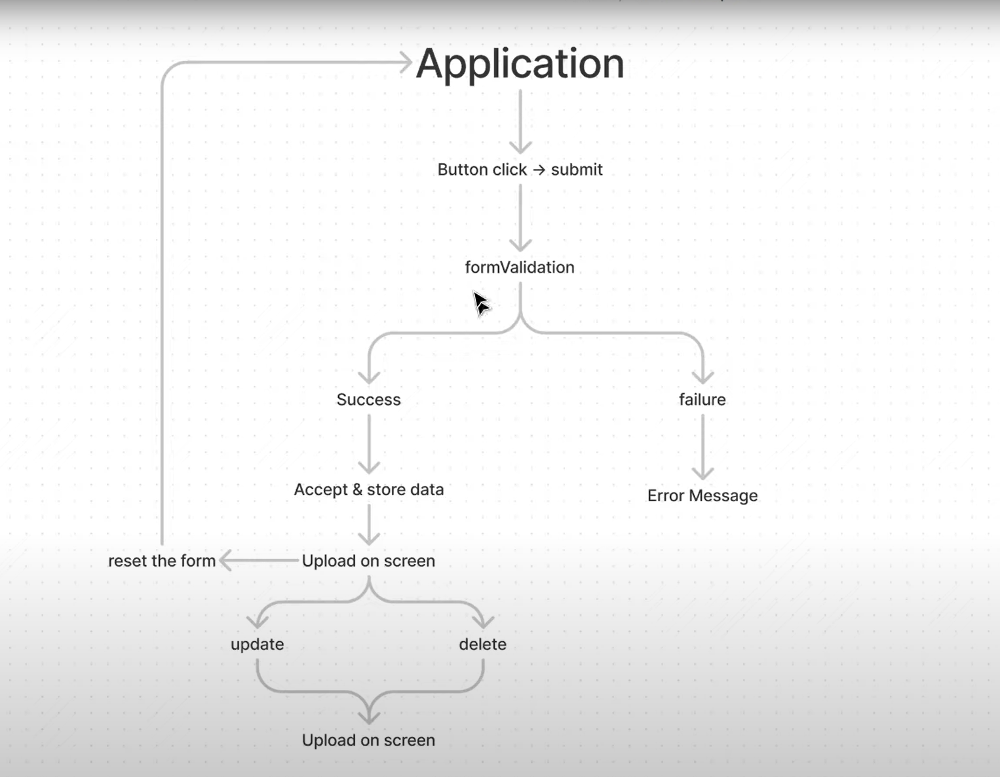

## Main structure of the Movie App:


## Browser API

### DOM API
The DOM (Document Object Model) API allows you to manipulate HTML and CSS, creating, removing and changing HTML, dynamically applying new styles to your page, etc. Every time you see a popup window appear on a page, or some new content displayed (as we saw above in our simple demo) for example, that's the DOM in action.

## Third party API
Third party APIs are not built into the browser by default, and you generally have to grab their code and information from somewhere on the Web. For example:
- The Twitter API allows you to do things like displaying your latest tweets on your website.
- The Google Maps API and OpenStreetMap API allows you to embed custom maps into your website, and other such functionality.

## Running order
When the browser encounters a block of JavaScript, it generally runs it in order, from top to bottom. This means that you need to be careful what order you put things in. For example, let's return to the block of JavaScript we saw in our first example:

```js
// selecting a text paragraph
const para = document.querySelector('p');

//attaching an event listener to it so that whenever the paragraph is clicked, the updateName() function is run.
para.addEventListener('click', updateName);

// asks the user for a new name, and then inserts that name into the paragraph to update the dispay. 
function updateName() {
  const name = prompt('Enter a new name');
  para.textContent = `Player 1: ${name}`;
}
```

If you swapped the order of the first two lines of code, it would no longer work — instead, you'd get an error returned in the browser developer console — TypeError: para is undefined. This means that the para object does not exist yet, so we can't add an event listener to it.

## Client versus server side
- Client side
    - when a web page is viewed, the page's client-side code is downloaded, then run and displayed by the browser. 
- Server side
    - Server-side code on the other hand is run on the server, then its results are downloaded and displayed in the browser.

## Dynamic versus static code 
it refers to the ability to update the display of a web page/app to show different things in different circumstances, generating new content as required. 

- Dynamic client-side JS

Client-side JavaScript dynamically generates new content inside the browser on the client, e.g. creating a new HTML table, filling it with data requested from the server, then displaying the table in a web page shown to the user. 
- Dynamic server-side JS

Server-side code dynamically generates new content on the server, e.g. pulling data from a database,

- Static web page

A web page with no dynamically updating content is referred to as static — it just shows the same content all the time.

## Use addEventListener
Instead of using
```JS
<button onclick="createParagraph()">Click me!</button>
```
We could choose all the buttons on the page by:
```JS
// querySelectorAll() function allows you to select all the buttons on a page
const buttons = document.querySelectorAll('button');

// loop through the buttons, 
for (const button of buttons) {
    //assign a handler for each using addEventListenr
  button.addEventListener('click', createParagraph);
}
```

```js
function createParagraph() {
  const para = document.createElement('p');
  para.textContent = 'You clicked the button!';
  document.body.appendChild(para);
}
```

## Script loading strategies

## async and defer
The defer attribute tells the browser to continue downloading the HTML content once the ```<script>``` tag element has been reached.

- async
```js
<script async src="js/vendor/jquery.js"></script>

<script async src="js/script2.js"></script>

<script async src="js/script3.js"></script>
```

You can't rely on the order the scripts will load in. jquery.js may load before or after script2.js and script3.js and if this is the case, any functions in those scripts depending on jquery will produce an error because jquery will not be defined at the time the script runs.

> scripts with an async attribute will execute as soon as the download is complete. This blocks the page and does not guarantee any specific execution order.

> If your scripts should be run immediately and they don't have any dependencies, then use async.


async should be used when you have a bunch of background scripts to load in, and you just want to get them in place as soon as possible. For example, maybe you have some game data files to load, which will be needed when the game actually begins, but for now you just want to get on with showing the game intro, titles, and lobby, without them being blocked by script loading.

- defer

Scripts loaded using the defer attribute (see below) will run in the order they appear in the page and execute them as soon as the script and content are downloaded:

```js
<script defer src="js/vendor/jquery.js"></script>

<script defer src="js/script2.js"></script>

<script defer src="js/script3.js"></script>
```
In the second example, we can be sure that jquery.js will load before script2.js and script3.js and that script2.js will load before script3.js. They won't run until the page content has all loaded, which is useful if your scripts depend on the DOM being in place (e.g. they modify one of more elements on the page).

> scripts with a defer attribute will load in the order they are in and will only execute once everything has finished loading.

> If your scripts need to wait for parsing and depend on other scripts and/or the DOM being in place, load them using defer and put their corresponding <script> elements in the order you want the browser to execute them.

